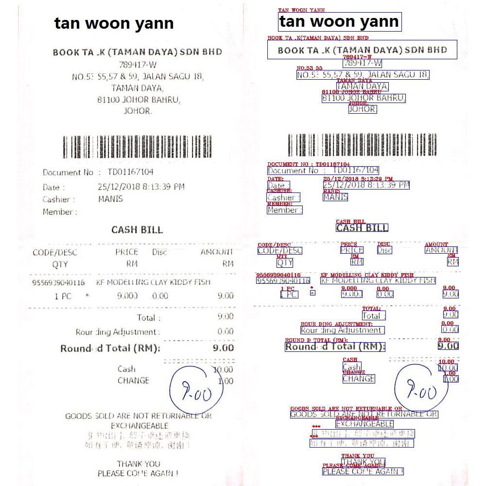
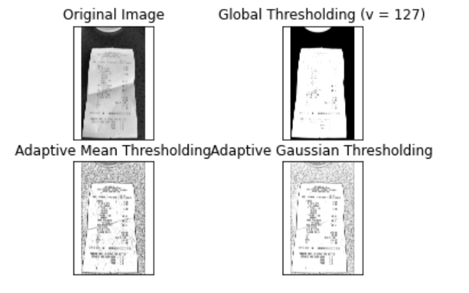

# Invoice_Digitization

#### I have Calculated the total earnings of Bojack's restaurant usiog invoice digitization

****I have used the training data given in this problem only to found out that regular expressions actually work 
best for these type of question where we are only supposed to extract the text from the image and search for a substring 
which contains the required attribute which in this case is the "Total Amount".****
#### 1. all the invoices of the restaurant in pdf format. I have to convert all the pdf invoices to jpg formate.
#### 2. Image preprocessing for better by tesseract accuracy.
#### 3. Setting 400 dpi.
#### 4. Extracting text from data.
#### 5. Filling the empty sequences.
#### 6. Searching terms like total, subtotal, and amount that may contain the total amount.
#### 7.finally predicting the results.
